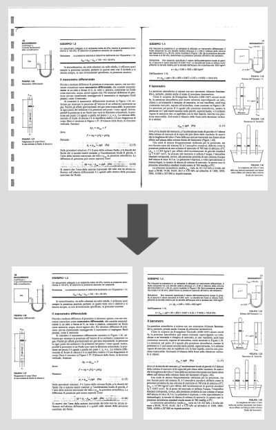

# scanned-books-crop-resize

This is a collection of bash/linux command useful for editing a scanned book. You start with a scanned double-page-per-side pdf and you come up with a single-page, cropped and reduced in size pdf.

## Required
In this procedure I assume that you are familiar with linux command line. If you don't, there are many tutorials out there.
You may have to install the following tools:

`poppler-utils`
`imagemagick`

## Procedure
The procedure is the following. We extract images from pdf file, then we crop the right pages and the left pages, we convert images back to pdf files and we join them toghether.
Note: to have a good result you must be very careful to scan the pages mantaining the book aligned in the same position, athought cropping may cut out part of text from some pages.

#### Create a directory to store extracted images
`mkdir img`
#### Extract pages from the pdf to image files
`pdfimages input.pdf img/page`

Check the
#### Now we must separate right pages from left so let's create two directories
`mkdir right/img`

`mkdir left/img`
#### We need to define the area to crop. We crop first the right side and then the left. To do so
Open one of the images in img/ with GIMP (or another image program), use rectangular selection tool to select the area you want to become the right page. Write down the position X0,Y0 and the size WIDTH,HEIGHT of the selection.
#### Now we can use imagemagick convert to crop right pages
`for a in img/*.pbm; do convert -crop WIDTHxHEIGHT+X0+Y0 $a right/$a ; done`

Remember to substitute the values with the one you wrote down.
#### We must now repeat the same (Size selectin and cropping) for the left pages
`for a in img/*.pbm; do convert -crop WIDTHxHEIGHT+X0+Y0 $a left/$a ; done`
#### To have pages ordered properly before we join right pages and left pages we rename the right pages
`rename .pbm b.pbm right/images/*`
#### Copy the right and the left pages in the same directory
`mkdir pages; cp left/img/* pages/; cp right/img/* pages/;`
#### convert all the images to pdf
`for a in pages/*; do convert $a $a.pdf; done`
#### and join them toghether
`pdfunite pages/*.pdf output.pdf`

## Quality settings
Now we have the final cropped pdf. That will probably a high quality, big file. We can adjust the size of our file:

`gs -dNOPAUSE -dBATCH -sDEVICE=pdfwrite -dCompatibilityLevel=1.4 -dPDFSETTINGS=setting -sOutputFile=output-final.pdf output.pdf`

replacing "output-final.pdf" with the name you want and "setting" with a desired quality level. Quality level settings are `/screen` the lowest resolution and lowest file size, but fine for viewing on a screen; `/ebook` a mid-point in resolution and file size; `/printer` and `/prepress` high-quality settings used for printing PDFs.

## Notes
Improvements to this procedure are welcome.
